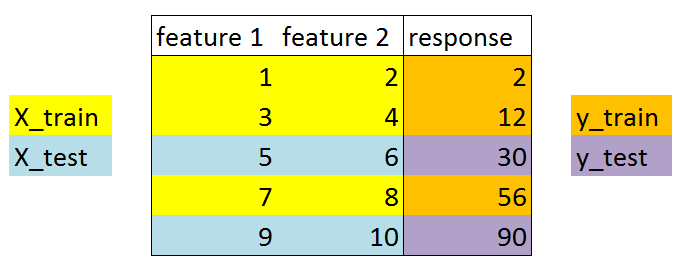
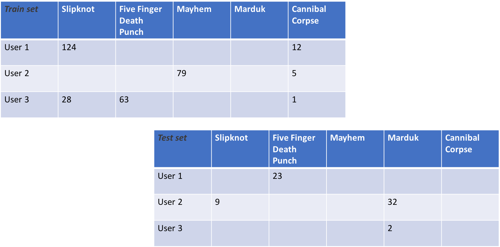

.. _train_test:

=================
Train/test splits
=================

As with all machine learning techniques, data splitting is recommended (pun!)
when fitting recommender systems. However, unlike most other machine learning
domains, the train/test split for collaborative filtering does not simply sample
rows for training.

Since most collaborative filtering techniques estimate factors or neighbors for
both users *as well as* items, the number of samples in the matrix is as
important a consideration as that of the matrix rank. Therefore, both the number
of samples as well as the dimensionality of the training and test data must
match that of the input data.

|

Conventional splitting
----------------------

Most data can be randomly split, or split with stratification. A typical
train/test split resembles the following:

Here's how we'd do that in Python:

.. code-block:: python

    from sklearn.datasets import load_iris
    from sklearn.model_selection import train_test_split

    X, y = load_iris(return_X_y=True)
    X_train, X_test, y_train, y_test = \
        train_test_split(X, y, test_size=0.2, random_state=42)

This is due to the fact that most machine learning algorithms only depend on
consistency of matrix rank, and operate invariant to the number of samples in the
matrix.

|

**Collaborative filtering is not quite the same**

|

Splitting for collaborative filtering
-------------------------------------

In (most) collaborative filtering, we have to ensure that the train set contains
ratings events for all items and users present in the data. This is because matrix
factorization techniques are going to decompose factors for both users (rows), as well as
items (columns). Therefore, a collaborative split can be considered more like data masking,
where the training set represents a system's collection of item ratings at a point in time,
and the test set represents the next items the user rated.

.. raw:: html

    

As an (obviously contrived) example, given the following input data:

We may split the data into a train/test set that resembles the following:

Obviously, we'd hope the input data had more than 11 ratings events!

.. raw:: html

    

Here's how we can achieve such a split in reclab:

.. code-block:: python

    from reclab.model_selection import train_test_split
    from reclab.datasets import load_lastfm
    import numpy as np

    lastfm = load_lastfm(cache=True, as_sparse=True)
    train, test = train_test_split(lastfm, random_state=42,
                                   train_size=0.8)

    # We can assert that the shape remains the same, even though the number of
    # non-zero elements in the sparse matrix is different
    n_users, n_artists = train.shape  # 1892, 17632
    assert n_users == lastfm.shape[0]
    assert n_artists == lastfm.shape[1]

    # Show the nnz is different:
    assert train.nnz != test.nnz and \
        train.nnz != lastfm.nnz and \
        test.nnz != lastfm.nnz

Other nuances
-------------

One of the first things you'll notice after splitting your data with reclab is that
the test set is not smaller than the training set. In fact, the test set contains *all* of
the data! This is due to the fact that recommender systems are not truly supervised learning
techniques; they are information retrieval methods.

The purpose of the test set during scoring is often to determine whether the recommendations
produced by the algorithm actually ended up being consumed/rated positively by the user. Therefore,
the test set can be considered a *future* state of the users' ratings, while the training set can be
thought of as a *past state*. As a result, the scoring techniques we use for recommenders fall more
into the family of information retrieval and relevancy (think search engine metrics) than conventional
"accuracy" measures.

|

Exceptions
----------

There are situations where a conventional train/test split could work for you:

* You don't care about user factors (in which case, you could use the ``recalculate_user``
  option when producing recommendations for users who didn't exist at the time of model fit,
  and a new test matrix that contains the new user(s))
* You are not using a matrix factorization or user-based method (i.e., cosine similarity
  between items)

However, since reclab uses sparse matrices, you'll likely have to perform your own
train/test split on a dense matrix and make it sparse prior to fitting any of the algorithms.
